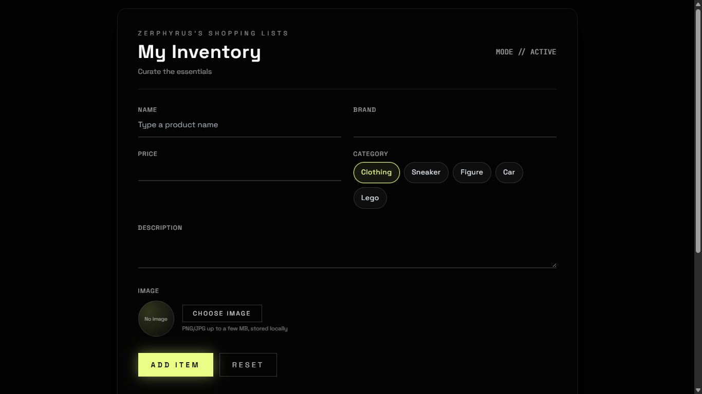

# Zephyrus's Shopping Lists

[](https://www.oracle.com/java/)
[](https://spring.io/projects/spring-boot)
[](https://maven.apache.org)

A modern shopping list and personal inventory web app. Create items with name, brand, category, price, description, and an optional image. The UI is built with HTML/CSS/JavaScript (Tailwind-styled) and the backend is a Spring Boot API that persists items via JPA.



## Table of Contents

- [What the project does](#what-the-project-does)
- [Why the project is useful](#why-the-project-is-useful)
- [Tech stack](#tech-stack)
- [Project structure](#project-structure)
- [Getting started](#getting-started)
- [Usage](#usage)
- [API quick reference](#api-quick-reference)
- [Help and support](#help-and-support)
- [Maintainers and contributing](#maintainers-and-contributing)

## What the project does

Shopping Lists lets you:

- Create items with name, brand, category chips, price, and description
- Attach an image per item (picked from local files)
- See items rendered in a styled list with quick actions (edit, delete)
- Persist items to a backend (when available) and cache locally for fast UX

The app serves a single page UI and REST endpoints:
- UI: `GET /` → renders the shopping list page
- API: `GET /products`, `POST /products/create`, `DELETE /products/{id}`

## Why the project is useful

- Fast and simple inventory tracking
- Works offline via local storage; when online, syncs with backend
- Clean UI with category chips and preview images
- Extensible backend with Spring Boot and JPA (PostgreSQL)
- Clear separation of concerns between frontend and backend

## Tech stack

- Backend:
  - Java 21
  - Spring Boot 4.0.1
  - Spring MVC, Spring Data JPA
  - PostgreSQL driver (runtime)
  - Thymeleaf template engine
  - `dotenv-java` for environment-driven configuration

- Frontend:
  - HTML template (`shopping-list.html`)
  - Tailwind CSS (via CDN)
  - Vanilla JavaScript (`shopping-list.js`)
  - Custom CSS (`shopping-list.css`)

- Languages (approx.):
  - JavaScript ~40.4%
  - Java ~36.0%
  - HTML ~14.6%
  - CSS ~9.0%

## Project structure

```text
pom.xml
src/
  main/
    java/
      com/kyaw/shoppingcart/
        ShoppingCartApplication.java
        controllers/
          HomeController.java        # "/" → shopping-list page
          ProductController.java     # /products endpoints
        dto/
          ProductDto.java            # Request/response model with validation
        models/
          Product.java               # JPA entity
        repositorys/
          ProductsRepository.java    # JPA repository
        service/
          ProductService.java        # Business logic, file storage
          ProductMapper.java         # Entity ↔ DTO mapping
          ExternalApiService.java    # Example external API client (optional auth)
    resources/
      templates/
        shopping-list.html           # Main UI
      static/
        shopping-list.css            # UI styles
        shopping-list.js             # UI logic, localStorage + API calls
uploads/                              # Runtime directory created for images (server-side)
```

## Getting started

### Prerequisites

- Java 21
- Maven 3.9+
- PostgreSQL (recommended; see environment config)
- Optional: A `.env` file for configuration

### 1) Clone

```bash
git clone https://github.com/Zephyrus-not-available/Shopping-lists.git
cd Shopping-lists
```

### 2) Configure environment

This app loads environment variables via `dotenv-java` on startup. Create a `.env` file in the project root to configure Spring properties and optional API key:

```properties
# Database (PostgreSQL)
spring.datasource.url=jdbc:postgresql://localhost:5432/shoppinglists
spring.datasource.username=postgres
spring.datasource.password=postgres

# JPA/Hibernate (auto-create/update tables)
spring.jpa.hibernate.ddl-auto=update

# Optional external API token used by ExternalApiService
external.api.key=
```

Ensure the database exists:
```bash
createdb shoppinglists
# or create it via your PostgreSQL admin tool
```

### 3) Build and run

Run with Maven:
```bash
mvn spring-boot:run
```

Or build a jar and run:
```bash
mvn clean package
java -jar target/Shopping-cart-0.0.1-SNAPSHOT.jar
```

Then open:
```
http://localhost:8080
```

## Usage

- From the UI:
  - Fill in Name, Brand, Price, select a Category chip
  - Add a Description, optionally choose an Image
  - Click “ADD ITEM” to create locally and attempt server creation
  - Use the trash icon to delete (tries server when `id` exists, otherwise deletes locally)
  - Items are cached using `localStorage` for snappy UX

- Images:
  - UI preview uses a data URL
  - Backend supports Base64 image uploads (`imageBase64`) and stores files in `uploads/`
  - Current UI primarily keeps image data client-side; extending it to send `imageBase64` is straightforward

## API quick reference

- Create an item:
  ```bash
  curl -X POST http://localhost:8080/products/create \
       -H "Content-Type: application/json" \
       -d '{
         "id": null,
         "name": "Red Sneakers",
         "brand": "Acme",
         "category": "Sneaker",
         "price": 79.99,
         "description": "Comfortable street shoes",
         "imageFileName": null,
         "imageBase64": null
       }'
  ```

- List items:
  ```bash
  curl http://localhost:8080/products
  ```

- Delete an item:
  ```bash
  curl -X DELETE http://localhost:8080/products/123
  ```

Response bodies use `ProductDto` fields:
```json
{
  "id": 123,
  "name": "Red Sneakers",
  "brand": "Acme",
  "category": "Sneaker",
  "price": 79.99,
  "description": "Comfortable street shoes",
  "createdAt": "2026-01-21T12:34:56Z",
  "updatedAt": "2026-01-21T12:34:56Z",
  "imageFileName": "/uploads/..."
}
```

## Help and support

- Open an issue in this repository if you need help or found a bug
- For feature requests, please describe the use case and proposed changes
- Consider sharing reproducible steps and environment details

## Maintainers and contributing

- Maintainer: @Zephyrus-not-available
- Contributions welcome! Suggested workflow:
  1. Fork the repository
  2. Create a feature branch: `git checkout -b feat/awesome-thing`
  3. Make changes with tests when applicable
  4. Run locally and verify UI/API
  5. Open a pull request with a clear description

Please keep PRs focused and include before/after notes or screenshots when UI changes are involved.

---
